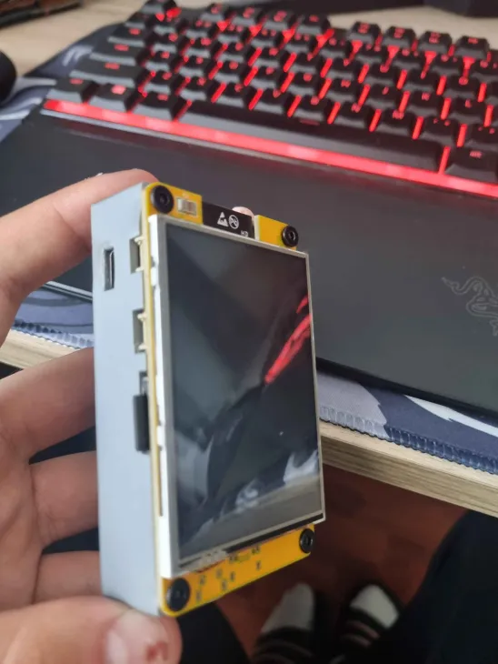
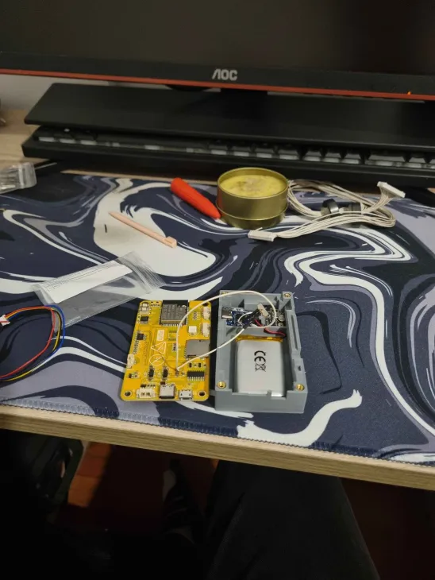

# Cheap Yellow Marauder (CYD) - DIY Build Log

🇷🇴 *[Citește documentația în Română](README.md)*

⚠️ **DISCLAIMER:** This device was assembled strictly for educational purposes. The ESP32 Marauder firmware is a powerful network testing (pentesting) tool. Using it against networks or devices without the owners' consent is illegal.

## About this build
This repository documents the physical (hardware) assembly of an ESP32 Marauder, using the "Cheap Yellow Display" (CYD) variant. Because commercial hardware projects of this type can be quite expensive, I chose to go the DIY (Do It Yourself) route to get a device with similar features at a fraction of the price, while also having a much larger battery capacity.

Here is the final result I achieved:

## Hardware Components List
The components used in this project follow the assembly guide presented by the HackedExistence YouTube channel:

* **Motherboard:** CYD (Cheap Yellow Display) - an ESP32 with an integrated touch screen and MicroSD card reader (USB-C port variant).
* **Battery:** 3000mAh Li-Po battery (model 97458) for extended battery life.
* **GPS Module:** ATGM336H, equipped with a ceramic antenna, for wardriving and saving coordinates.
* **Charging:** Dedicated USB-C charging circuit (1 Amp) for the battery.
* **Control:** A slide switch to turn the battery circuit power on and off.
* **Case:** 3D printed case (front, back, and stylus holder) secured with four M3x6mm screws and M3 threaded inserts.
* **GPS Module:** For the wardriving feature (ATGM336H).
* **MicroSD Card:** Storage.

## Firmware and Installation
The device runs the ESP32 Marauder firmware variant specially ported for the CYD board. 

To flash the firmware:
1. I used the repository maintained by **Frank Fletcher** (esp32-Marauder-cheap-yellow-display).
2. The installation was done directly from the browser via Web Flasher (USB serial connection).
3. I selected the `CYD to USB` firmware variant, which also includes support for the GPS module.

## Features Achieved
Thanks to the installed hardware and firmware, this device is capable of:
* **Wardriving:** Scanning and mapping Wi-Fi networks and Bluetooth devices using GPS data.
* **Wi-Fi / Bluetooth Analysis:** Packet sniffing, deauth attacks (on owned networks), BLE spamming.
* **Offline Storage:** All captures (PCAP) and captured data can be saved directly to a MicroSD card installed behind the screen.

## Credits and Resources
This build would not have been possible without the amazing work of the open-source community:
* **[JustCallMeCoco](https://github.com/justcallmecoco/ESP32Marauder)** - For creating the phenomenal original ESP32 Marauder firmware.
* **[HackedExistence](https://www.youtube.com/watch?v=0xVrZQx4MY4)** - For the detailed video guide and clarifying the hardware connections for the battery and GPS.
* **[Frank Fletcher](https://github.com/Fr4nkF13tch3r/ESP32-Marauder-Cheap-Yellow-Display)** - For adapting the original code for the cheap CYD screens.

---
*Note: I assembled this device out of a passion for hardware and passed it on to another enthusiast, so this repository serves as a log of my build!*
